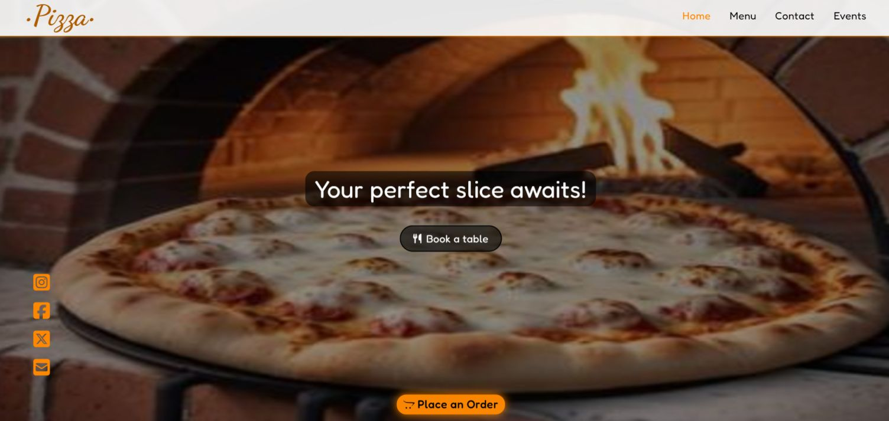
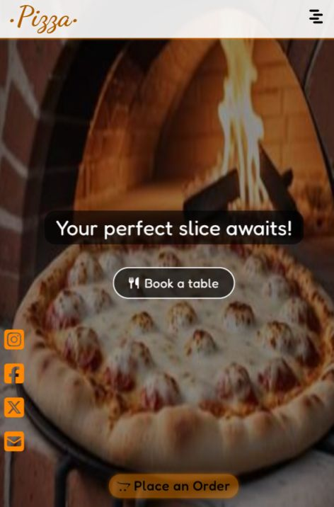

<div align='center'>

# Restaurant

</div>
<div align='center'>
    <h3>💻 Technologies</h3>
    
    
    
    
    
    
    
    
    
    
    
    
    
    
    
    <h4><a href="https://digiresttemplate.vercel.app/">Live Preview</a></h4>
</div>

<!-- **Demo:** -->

<!--  -->

<details>

**<summary>Screen views</summary>**

**Desktop View:**


<br>

**Tablet View:**


<br>

**Mobile View:**



</details>

## 🌐 Origin

Personal

## 📝 Description

Template restaurant website for [DigiairX](https://www.digiairx.com/).

<details>
<summary>Features</summary>

- ###

</details>

## 🎯 Relevance

To build sites that can be used to take order and make reservations.

## 👥 Intended Audience

Developers, users, and non-developers.

> [!NOTE]
> Users can install all dependencies using `package.json` file via:
>
> ```bash
> npm install
> ```
>
> To use `manageDeployments.sh`:
>
> ```bash
> sudo apt install gh
> gh auth login
> sudo apt-get install jq
> chmod +x manageDeployments.sh
> ./manageDeployments.sh
> ```

## 📂 Files

<details>
<summary>Invert</summary>

| File                         | Description                                                                                  |
| ---------------------------- | -------------------------------------------------------------------------------------------- |
| `src/*`                      | Source files that are bundled into the output directory `dist/`.                             |
| `src/main.jsx`               | The main JavaScript entry point that bundling begins.                                        |
| `src/App.jsx`                | Main component where overall structure and other layout components of the app are contained. |
| `src/assets/*`               | All assets(images, icons, vids) used in website.                                             |
| `src/components/Contact`     | Components and stylesheet for Contact section.                                               |
| `src/components/Events`      | Components and stylesheet for Events section.                                                |
| `src/components/FixedOrder`  | Components and stylesheet for sections that are fixed - `Place order` and socials.           |
| `src/components/Home`        | Components and stylesheet for Home section.                                                  |
| `src/components/Menu`        | Components and stylesheet for Menu section.                                                  |
| `src/components/Nav`         | Components and stylesheet for Navigation.                                                    |
| `src/components/ScrollToTop` | Component used by all other components to scroll to top onClick.                             |
| `src/components/index.js`    | Imports all assets - images and stylesheets and exports all to other components.             |
| `src/App.css`                | React stylesheet that contains few default styles.                                           |
| `src/index.css`              | Tailwind main stylesheet.                                                                    |
| `src/reset.css`              | Resets style to default for consistency across different devices and browsers.               |
| `dist/*`                     | Output files from bundling of files in directory `src/`.                                     |
| `package*`                   | Contains details of project and dependencies versions.                                       |
| `readme-assets/*`            | Live demo and different screen views used in `README.md`.                                    |

</details>

## ©️ Credit

<details>
<summary>Invert</summary>

| File | Description |
| ---- | ----------- |

</details>

## 🔄 Improvements

<details>
<summary>Invert</summary>

- [ ] Use tailwind CSS for all components

</details>

## 👤 Curator

1. [Name](https://github.com/asdacosta)

**[🞁 Top](#restaurant)**
